# Data Flow Documentation

## 🔄 Overview

This document describes how data flows through the GPU Price Scraper system, from initial scraping to final presentation in the dashboard.

---

## 📊 Scraping Pipeline

### Complete Scraping Flow


---

## 🧹 Data Processing Pipeline

### Transformation Stages


### Stage Details

**1. Data Cleaner**

```python
Input:  {"title": "  RTX 4090  ", "price": "R$ 10.000,00"}
Output: {"title": "RTX 4090", "price": 10000.00}
```

**Operations:**

- Trim whitespace
- Normalize price format (remove currency symbols)
- Fix character encoding
- Standardize text case

**2. Data Validator**

```python
Checks:
- Price > 0 and < 100000
- URL is valid HTTP/HTTPS
- Title length > 5 characters
- Store is in allowed list
```

**3. Data Enricher**

```python
Input:  {"title": "ASUS ROG RTX 4090"}
Output: {
  "title": "ASUS ROG RTX 4090",
  "chip_brand": "NVIDIA",
  "manufacturer": "ASUS",
  "model": "RTX 4090"
}
```

---

## 📈 Analytics Pipeline

### Price Trends Calculation


### Analytics Flow


---

## 🔍 API Request Flow

### GET /api/v1/products

```mermaid
sequenceDiagram
    participant Client
    participant Nginx
    participant FastAPI
    participant Auth
    participant RateLimit
    participant Cache
    participant Database
    
    Client->>Nginx: GET /api/v1/products?chip_brand=NVIDIA
    Nginx->>FastAPI: Forward request
    FastAPI->>Auth: Validate API key
    Auth-->>FastAPI: ✓ Valid
    FastAPI->>RateLimit: Check rate limit
    RateLimit-->>FastAPI: ✓ Within limit
    FastAPI->>Cache: Check cache
    Cache-->>FastAPI: Cache miss
    FastAPI->>Database: SELECT * FROM products WHERE chip_brand='NVIDIA'
    Database-->>FastAPI: Product list
    FastAPI->>Cache: Store result
    FastAPI-->>Nginx: JSON response
    Nginx-->>Client: Compressed response
```



---

## 💾 Database Operations

### Product Insert Flow


### Query Optimization Flow


---

## 🔄 Real-Time Updates

### Dashboard Data Refresh


---

## 📤 Data Export Flow

### CSV Export


### JSON Export


---

## 🔐 Authentication Flow


---

## ⚡ Caching Strategy

### Multi-Level Cache


### Cache Invalidation


---

## 🚨 Error Handling Flow


---

## 📊 Data Lifecycle


---

## 🔄 Batch Processing

### Nightly Analytics Job


---

**Last Updated:** 2026-01-26  
**Version:** 2.0.0
