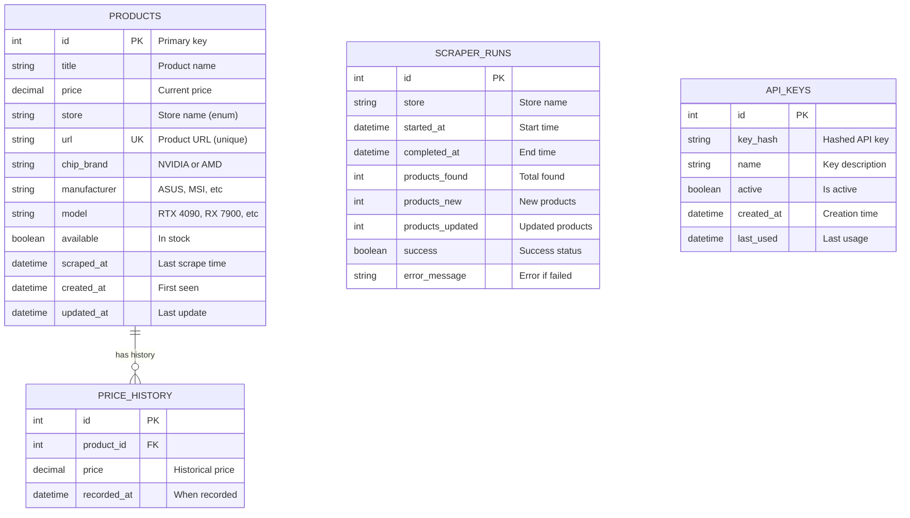

# Database Schema Documentation

## 📊 Entity Relationship Diagram



---

## 📋 Table Definitions

### Products Table

**Purpose:** Stores current product information from all stores.

```sql
CREATE TABLE products (
    id SERIAL PRIMARY KEY,
    title VARCHAR(500) NOT NULL,
    price DECIMAL(10, 2) NOT NULL CHECK (price > 0),
    store VARCHAR(50) NOT NULL,
    url TEXT NOT NULL UNIQUE,
    chip_brand VARCHAR(50),
    manufacturer VARCHAR(100),
    model VARCHAR(200),
    available BOOLEAN DEFAULT true,
    scraped_at TIMESTAMP NOT NULL DEFAULT NOW(),
    created_at TIMESTAMP NOT NULL DEFAULT NOW(),
    updated_at TIMESTAMP NOT NULL DEFAULT NOW()
);

-- Indexes for performance
CREATE INDEX idx_products_store ON products(store);
CREATE INDEX idx_products_chip_brand ON products(chip_brand);
CREATE INDEX idx_products_price ON products(price);
CREATE INDEX idx_products_available ON products(available);
CREATE INDEX idx_products_scraped_at ON products(scraped_at DESC);
```

**Constraints:**

- `price` must be positive
- `url` must be unique
- `store` must be one of: Pichau, Kabum, Terabyte

---

### Price History Table

**Purpose:** Tracks price changes over time for analytics.

```sql
CREATE TABLE price_history (
    id SERIAL PRIMARY KEY,
    product_id INTEGER NOT NULL REFERENCES products(id) ON DELETE CASCADE,
    price DECIMAL(10, 2) NOT NULL,
    recorded_at TIMESTAMP NOT NULL DEFAULT NOW()
);

-- Indexes
CREATE INDEX idx_price_history_product ON price_history(product_id);
CREATE INDEX idx_price_history_recorded ON price_history(recorded_at DESC);

-- Composite index for common queries
CREATE INDEX idx_price_history_product_time 
    ON price_history(product_id, recorded_at DESC);
```

**Retention:** Keep 90 days of history, archive older data.

---

### Scraper Runs Table

**Purpose:** Logs scraper execution metrics and status.

```sql
CREATE TABLE scraper_runs (
    id SERIAL PRIMARY KEY,
    store VARCHAR(50) NOT NULL,
    started_at TIMESTAMP NOT NULL,
    completed_at TIMESTAMP,
    products_found INTEGER DEFAULT 0,
    products_new INTEGER DEFAULT 0,
    products_updated INTEGER DEFAULT 0,
    success BOOLEAN DEFAULT false,
    error_message TEXT,
    duration_seconds INTEGER GENERATED ALWAYS AS 
        (EXTRACT(EPOCH FROM (completed_at - started_at))) STORED
);

-- Indexes
CREATE INDEX idx_scraper_runs_store ON scraper_runs(store);
CREATE INDEX idx_scraper_runs_started ON scraper_runs(started_at DESC);
CREATE INDEX idx_scraper_runs_success ON scraper_runs(success);
```

---

### API Keys Table

**Purpose:** Manages API authentication keys.

```sql
CREATE TABLE api_keys (
    id SERIAL PRIMARY KEY,
    key_hash VARCHAR(255) NOT NULL UNIQUE,
    name VARCHAR(200) NOT NULL,
    active BOOLEAN DEFAULT true,
    created_at TIMESTAMP NOT NULL DEFAULT NOW(),
    last_used TIMESTAMP,
    usage_count INTEGER DEFAULT 0
);

-- Indexes
CREATE INDEX idx_api_keys_hash ON api_keys(key_hash);
CREATE INDEX idx_api_keys_active ON api_keys(active);
```

---

## 🔍 Common Queries

### Get Latest Products

```sql
SELECT 
    id,
    title,
    price,
    store,
    chip_brand,
    manufacturer,
    available
FROM products
WHERE available = true
ORDER BY scraped_at DESC
LIMIT 50;
```

### Search Products

```sql
SELECT *
FROM products
WHERE 
    title ILIKE '%RTX 4090%'
    AND available = true
    AND price BETWEEN 8000 AND 12000
ORDER BY price ASC;
```

### Price History for Product

```sql
SELECT 
    p.title,
    ph.price,
    ph.recorded_at
FROM products p
JOIN price_history ph ON p.id = ph.product_id
WHERE p.id = 123
ORDER BY ph.recorded_at DESC
LIMIT 30;
```

### Best Deals (Lowest Prices)

```sql
SELECT 
    title,
    price,
    store,
    url,
    chip_brand
FROM products
WHERE available = true
ORDER BY price ASC
LIMIT 10;
```

### Scraper Success Rate

```sql
SELECT 
    store,
    COUNT(*) as total_runs,
    SUM(CASE WHEN success THEN 1 ELSE 0 END) as successful_runs,
    ROUND(
        100.0 * SUM(CASE WHEN success THEN 1 ELSE 0 END) / COUNT(*),
        2
    ) as success_rate
FROM scraper_runs
WHERE started_at >= NOW() - INTERVAL '7 days'
GROUP BY store;
```

---

## 📈 Data Statistics

### Current Database Size

```sql
SELECT 
    schemaname,
    tablename,
    pg_size_pretty(pg_total_relation_size(schemaname||'.'||tablename)) AS size
FROM pg_tables
WHERE schemaname = 'public'
ORDER BY pg_total_relation_size(schemaname||'.'||tablename) DESC;
```

### Row Counts

```sql
SELECT 
    'products' as table_name,
    COUNT(*) as row_count
FROM products
UNION ALL
SELECT 'price_history', COUNT(*) FROM price_history
UNION ALL
SELECT 'scraper_runs', COUNT(*) FROM scraper_runs;
```

---

## 🔧 Maintenance

### Vacuum and Analyze

```sql
-- Regular maintenance
VACUUM ANALYZE products;
VACUUM ANALYZE price_history;

-- Full vacuum (requires downtime)
VACUUM FULL products;
```

### Archive Old Data

```sql
-- Archive price history older than 90 days
DELETE FROM price_history
WHERE recorded_at < NOW() - INTERVAL '90 days';

-- Archive old scraper runs
DELETE FROM scraper_runs
WHERE started_at < NOW() - INTERVAL '180 days';
```

### Reindex

```sql
-- Rebuild indexes for performance
REINDEX TABLE products;
REINDEX TABLE price_history;
```

---

## 🚀 Migrations

### Using Alembic

```bash
# Create new migration
alembic revision --autogenerate -m "Add new column"

# Apply migrations
alembic upgrade head

# Rollback
alembic downgrade -1
```

### Example Migration

```python
"""Add manufacturer column

Revision ID: abc123
"""
from alembic import op
import sqlalchemy as sa

def upgrade():
    op.add_column('products', 
        sa.Column('manufacturer', sa.String(100), nullable=True)
    )
    op.create_index('idx_products_manufacturer', 
        'products', ['manufacturer']
    )

def downgrade():
    op.drop_index('idx_products_manufacturer')
    op.drop_column('products', 'manufacturer')
```

---

## 📊 Performance Tuning

### Index Usage

```sql
-- Check index usage
SELECT 
    schemaname,
    tablename,
    indexname,
    idx_scan as index_scans,
    idx_tup_read as tuples_read,
    idx_tup_fetch as tuples_fetched
FROM pg_stat_user_indexes
ORDER BY idx_scan DESC;
```

### Slow Queries

```sql
-- Enable query logging in postgresql.conf
log_min_duration_statement = 1000  # Log queries > 1s

-- View slow queries
SELECT 
    query,
    calls,
    total_time,
    mean_time,
    max_time
FROM pg_stat_statements
ORDER BY mean_time DESC
LIMIT 10;
```

---

## 🔒 Security

### Row-Level Security (Future)

```sql
-- Enable RLS
ALTER TABLE products ENABLE ROW LEVEL SECURITY;

-- Create policy
CREATE POLICY products_select_policy ON products
    FOR SELECT
    USING (available = true OR current_user = 'admin');
```

### Backup Strategy

```bash
# Daily backup
pg_dump -U postgres gpuscraper > backup_$(date +%Y%m%d).sql

# Restore
psql -U postgres gpuscraper < backup_20260126.sql
```

---

**Last Updated:** 2026-01-26  
**Version:** 2.0.0
