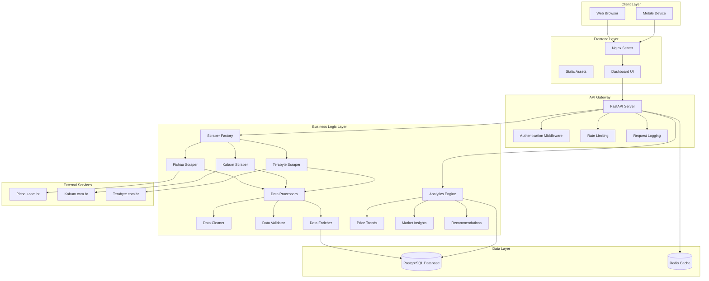
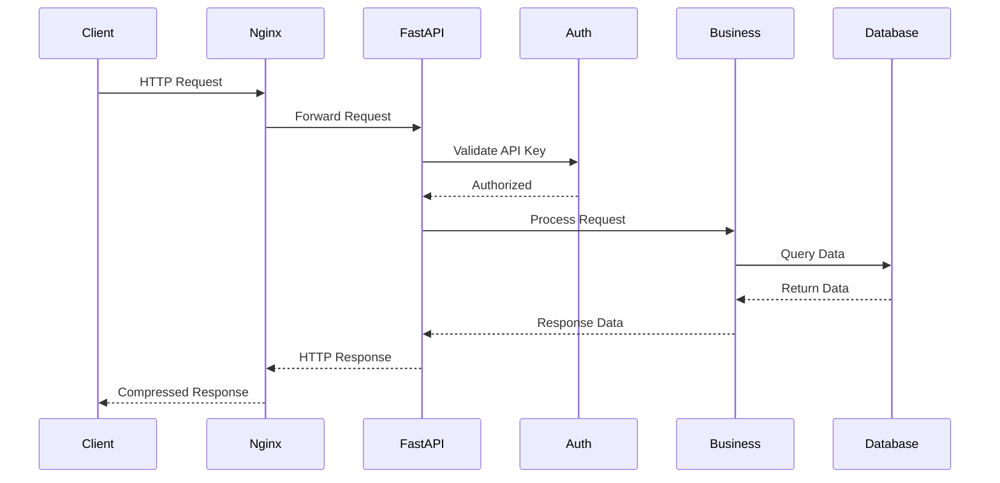

# System Architecture Overview

## 🏗️ High-Level Architecture



---

## 📦 Component Descriptions

### Frontend Layer

**Nginx Server**

- Serves static files (HTML, CSS, JS)
- Reverse proxy to FastAPI
- Gzip compression
- Security headers
- SSL/TLS termination (production)

**Dashboard UI**

- Modern, responsive web interface
- Vanilla JavaScript (no framework)
- Real-time data updates
- Interactive charts (Chart.js)
- Mobile-first design

### API Gateway

**FastAPI Server**

- RESTful API endpoints
- OpenAPI/Swagger documentation
- Async request handling
- WebSocket support (future)
- CORS configuration

**Middleware Stack**

1. **Authentication:** API key validation
2. **Rate Limiting:** 60 requests/minute per IP
3. **Logging:** Structured request/response logs
4. **Error Handling:** Consistent error responses

### Business Logic Layer

**Scraper System**

- **Factory Pattern:** Dynamic scraper creation
- **Template Method:** Common scraping workflow
- **Playwright:** Browser automation
- **Anti-Detection:** Stealth techniques
- **Retry Logic:** Automatic failure recovery

**Data Processing Pipeline**

1. **Cleaner:** Normalize prices, fix encoding, standardize names
2. **Validator:** Check data integrity, validate URLs, price ranges
3. **Enricher:** Extract chip brand, manufacturer, model info

**Analytics Engine**

- **Price Trends:** Moving averages, outlier detection
- **Market Insights:** Store comparison, brand analysis
- **Recommendations:** Best deals, price alerts

### Data Layer

**PostgreSQL Database**

- Primary data store
- ACID compliance
- Full-text search
- Indexing for performance
- Connection pooling

**Redis Cache**

- API response caching
- Session storage
- Rate limiting counters
- Temporary data

---

## 🛠️ Technology Stack

### Backend

| Technology | Version | Purpose |
|------------|---------|---------|
| Python | 3.11 | Core language |
| FastAPI | 0.109 | Web framework |
| SQLAlchemy | 2.0 | ORM |
| Playwright | 1.41 | Browser automation |
| Pydantic | 2.5 | Data validation |
| Structlog | 24.1 | Logging |

### Frontend

| Technology | Version | Purpose |
|------------|---------|---------|
| HTML5 | - | Structure |
| CSS3 | - | Styling |
| JavaScript | ES6+ | Logic |
| Chart.js | 4.4 | Visualizations |
| Nginx | 1.29 | Web server |

### Infrastructure

| Technology | Version | Purpose |
|------------|---------|---------|
| Docker | 20.10+ | Containerization |
| PostgreSQL | 15 | Database |
| Redis | 7.0 | Caching |
| GitHub Actions | - | CI/CD |

---

## 🎨 Design Patterns

### Creational Patterns

**Factory Pattern** (`ScraperFactory`)

- Creates scraper instances dynamically
- Encapsulates scraper instantiation
- Allows easy addition of new scrapers

**Singleton Pattern** (`Database`)

- Single database connection pool
- Shared across application
- Thread-safe implementation

### Structural Patterns

**Repository Pattern** (`ProductRepository`)

- Abstracts data access
- Separates business logic from data layer
- Testable with mocks

**Facade Pattern** (`DataProcessor`)

- Simplifies complex subsystems
- Unified interface for data processing
- Hides implementation details

### Behavioral Patterns

**Template Method** (`BaseScraper`)

- Defines scraping algorithm skeleton
- Subclasses implement specific steps
- Code reuse across scrapers

**Strategy Pattern** (`Analytics`)

- Interchangeable algorithms
- Different analysis strategies
- Runtime selection

---

## 📈 Scalability Considerations

### Horizontal Scaling

**API Layer**

- Stateless design
- Load balancer ready
- Multiple instances supported

**Scraper Layer**

- Distributed scraping
- Queue-based job distribution
- Worker pool pattern

### Vertical Scaling

**Database**

- Connection pooling
- Query optimization
- Indexing strategy
- Read replicas (future)

**Caching**

- Redis for hot data
- API response caching
- Query result caching

### Performance Optimizations

**Database**

- Indexes on frequently queried columns
- Batch inserts for scraped data
- Async queries where possible

**API**

- Response pagination
- Field selection
- Gzip compression
- HTTP caching headers

**Scraping**

- Concurrent page processing
- Browser instance reuse
- Intelligent retry backoff

---

## 🔒 Security Architecture

### Authentication & Authorization

**API Key Authentication**

- Header-based: `X-API-Key`
- Environment variable storage
- Per-endpoint protection

**Future Enhancements**

- OAuth2 integration
- JWT tokens
- Role-based access control (RBAC)

### Data Protection

**Input Validation**

- Pydantic models
- SQL injection prevention
- XSS protection
- CSRF tokens (future)

**Secrets Management**

- Environment variables
- Docker secrets (production)
- No hardcoded credentials

### Network Security

**CORS**

- Configured allowed origins
- Credential support
- Method restrictions

**Rate Limiting**

- IP-based throttling
- Per-endpoint limits
- Sliding window algorithm

---

## 🔄 Data Flow

### Request Flow



---

## 📊 Monitoring & Observability

### Logging

**Structured Logging**

- JSON format
- Contextual information
- Log levels (DEBUG, INFO, WARNING, ERROR)
- Request tracing

**Log Aggregation**

- Centralized logging (future)
- Log rotation
- Retention policies

### Metrics

**Application Metrics**

- Request count
- Response time
- Error rate
- Cache hit rate

**Business Metrics**

- Products scraped
- Scraper success rate
- API usage
- User activity

### Health Checks

**Endpoints**

- `/health` - Basic health
- `/health/detailed` - Component status

**Monitored Components**

- Database connectivity
- Redis connectivity
- Disk space
- Memory usage

---

## 🚀 Deployment Architecture

### Development

```
Developer Machine
├── Docker Compose
│   ├── Backend Container
│   ├── Frontend Container
│   └── PostgreSQL Container
└── Local Browser
```

### Production

```
Cloud Provider (AWS/GCP/Azure)
├── Load Balancer
├── Application Servers (2+)
│   ├── Backend Containers
│   └── Frontend Containers
├── Database Cluster
│   ├── Primary
│   └── Replicas
└── Redis Cluster
```

---

## 📝 Future Enhancements

### Short Term

- [ ] WebSocket support for real-time updates
- [ ] GraphQL API
- [ ] Advanced caching strategies
- [ ] Database read replicas

### Long Term

- [ ] Microservices architecture
- [ ] Kubernetes deployment
- [ ] Message queue (RabbitMQ/Kafka)
- [ ] Machine learning price predictions
- [ ] Mobile app (React Native)

---

**Last Updated:** 2026-01-26  
**Version:** 2.0.0
